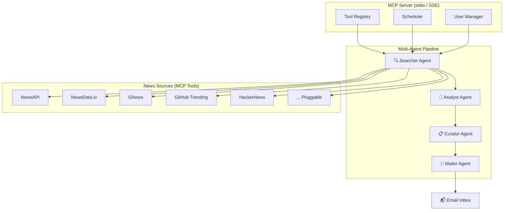

# Multi-Agent MCP News Server — Implementation Plan

A TypeScript-based MCP server that aggregates news from multiple sources, uses a multi-agent pipeline to search/filter/curate content based on user interests, and delivers a beautifully formatted daily email digest.

---

## Architecture Overview



---

## Core Concepts

### How It Works (User Flow)

1. **Subscribe** — User calls the `subscribe` MCP tool with their email + a natural-language interest description (e.g., *"AI/ML, TypeScript frameworks, new gadgets, open-source tools"*)
2. **Scheduled Fetch** — A cron scheduler triggers the pipeline at configurable intervals (default: every 6 hours)
3. **Multi-Agent Pipeline** runs:
   - **Searcher Agent** — queries all registered news sources in parallel using the user's interest keywords
   - **Analyst Agent** — scores & ranks each article for relevance to the user's interests using an LLM
   - **Curator Agent** — selects the top N articles, deduplicates, groups by topic, and writes brief summaries
   - **Mailer Agent** — renders a beautiful HTML email and sends it
4. **On-demand** — User can also call `get_news_now` to immediately trigger the pipeline and get results inline

### Pluggable Source Architecture

Each news source is an independent **MCP Tool** registered with the server. Adding a new source = adding a new file in `src/sources/` that implements the `NewsSource` interface. No changes to the core pipeline needed.

---

## Proposed Changes

### Project Structure

```
News Agent/
├── package.json
├── tsconfig.json
├── .env.example
├── src/
│   ├── index.ts                    # MCP server entry point
│   ├── server.ts                   # MCP server setup & tool registration
│   ├── config.ts                   # Environment & configuration
│   ├── types.ts                    # Shared TypeScript interfaces
│   ├── sources/                    # Pluggable news source connectors
│   │   ├── base.ts                 # NewsSource interface
│   │   ├── newsapi.ts              # NewsAPI connector
│   │   ├── newsdata.ts             # NewsData.io connector
│   │   ├── gnews.ts                # GNews connector
│   │   ├── github-trending.ts      # GitHub Trending scraper
│   │   └── hackernews.ts           # HackerNews API
│   ├── agents/                     # Multi-agent pipeline
│   │   ├── orchestrator.ts         # Pipeline coordinator
│   │   ├── searcher.ts             # Searcher Agent
│   │   ├── analyst.ts              # Analyst Agent (LLM-powered scoring)
│   │   ├── curator.ts              # Curator Agent (select + summarize)
│   │   └── mailer.ts               # Mailer Agent (format + send)
│   ├── db/                         # User data persistence
│   │   ├── database.ts             # SQLite setup
│   │   └── users.ts                # User CRUD operations
│   ├── email/                      # Email templates
│   │   └── template.ts             # HTML email template (MJML)
│   ├── scheduler/
│   │   └── cron.ts                 # Cron job manager
│   └── utils/
│       ├── logger.ts               # Structured logging
│       └── dedup.ts                # Article deduplication
├── tests/
│   ├── sources/
│   │   └── newsapi.test.ts
│   ├── agents/
│   │   ├── searcher.test.ts
│   │   ├── analyst.test.ts
│   │   └── curator.test.ts
│   └── pipeline.test.ts            # Integration test
└── data/                           # SQLite DB file (gitignored)
```

---

### Component Details

---

#### [NEW] [package.json](file:///home/akshay/News%20Agent/package.json)

Dependencies:
- `@modelcontextprotocol/sdk` — MCP server SDK
- `zod` — schema validation for tool inputs
- `better-sqlite3` — lightweight embedded DB for user subscriptions
- `node-cron` — scheduling
- `nodemailer` — email sending
- `mjml` — responsive email templates
- `openai` (or `@google/generative-ai`) — LLM for the Analyst/Curator agents
- `axios` — HTTP client for API calls
- `winston` — structured logging
- `dotenv` — config management
- `vitest` — testing

---

#### [NEW] [src/types.ts](file:///home/akshay/News%20Agent/src/types.ts)

Core interfaces:

```typescript
interface NewsArticle {
  id: string;
  title: string;
  description: string;
  url: string;
  source: string;          // which connector found it
  publishedAt: Date;
  imageUrl?: string;
  category?: string;
}

interface UserProfile {
  id: string;
  email: string;
  interests: string;       // natural-language description
  keywords: string[];      // extracted keywords from interests
  createdAt: Date;
  lastDigestAt?: Date;
}

interface NewsSource {
  name: string;
  search(keywords: string[]): Promise<NewsArticle[]>;
}

interface AgentResult<T> {
  data: T;
  metadata: { agentName: string; durationMs: number; itemCount: number };
}
```

---

#### [NEW] [src/server.ts](file:///home/akshay/News%20Agent/src/server.ts)

MCP server with the following **tools** exposed:

| Tool | Description | Inputs |
|------|-------------|--------|
| `subscribe` | Register for personalized news digests | `email`, `interests` (free-text) |
| `unsubscribe` | Remove subscription | `email` |
| `update_interests` | Change your interest profile | `email`, `interests` |
| `get_news_now` | Immediately fetch & return curated news | `email` (optional, for personalization) |
| `list_sources` | Show all registered news sources | — |
| `add_source` | Dynamically register a new source (future) | `sourceConfig` |

---

#### [NEW] [src/sources/base.ts](file:///home/akshay/News%20Agent/src/sources/base.ts)

Abstract `NewsSource` class with:
- `name: string` — unique identifier
- `search(keywords: string[]): Promise<NewsArticle[]>` — fetch articles matching keywords
- Rate limiting and error handling built in

---

#### [NEW] [src/sources/newsapi.ts](file:///home/akshay/News%20Agent/src/sources/newsapi.ts)

Connector for [NewsAPI.org](https://newsapi.org):
- Uses `/v2/everything` and `/v2/top-headlines` endpoints
- Searches by keyword, category, and language
- Free tier: 100 requests/day

---

#### [NEW] [src/sources/newsdata.ts](file:///home/akshay/News%20Agent/src/sources/newsdata.ts)

Connector for [NewsData.io](https://newsdata.io):
- Uses `/news` endpoint with keyword + category filters
- Supports 89 languages, 206 countries
- Free tier: 200 credits/day

---

#### [NEW] [src/sources/gnews.ts](file:///home/akshay/News%20Agent/src/sources/gnews.ts)

Connector for [GNews.io](https://gnews.io):
- `/search` and `/top-headlines` endpoints
- Free tier: 100 requests/day

---

#### [NEW] [src/sources/github-trending.ts](file:///home/akshay/News%20Agent/src/sources/github-trending.ts)

GitHub Trending scraper:
- Scrapes `https://github.com/trending` via HTML parsing (cheerio)
- Filters by language and timeframe (daily/weekly)
- Maps repositories to `NewsArticle` format

---

#### [NEW] [src/sources/hackernews.ts](file:///home/akshay/News%20Agent/src/sources/hackernews.ts)

HackerNews connector:
- Uses official Firebase API (`https://hacker-news.firebaseio.com/v0/`)
- Fetches top/best/new stories
- No API key required

---

#### [NEW] [src/agents/orchestrator.ts](file:///home/akshay/News%20Agent/src/agents/orchestrator.ts)

Pipeline coordinator:
```
Searcher → Analyst → Curator → Mailer
```
- Runs agents sequentially, passing results downstream
- Handles errors gracefully (if one source fails, continues with others)
- Logs timing and metrics for each stage

---

#### [NEW] [src/agents/searcher.ts](file:///home/akshay/News%20Agent/src/agents/searcher.ts)

**Searcher Agent** — queries all registered sources in parallel:
- Takes user's keywords
- Calls `source.search(keywords)` on every registered source concurrently
- Merges and deduplicates results by URL
- Returns raw article list

---

#### [NEW] [src/agents/analyst.ts](file:///home/akshay/News%20Agent/src/agents/analyst.ts)

**Analyst Agent** — LLM-powered relevance scoring:
- Takes the raw article list + user's interest description
- Sends batches to OpenAI / Gemini with a structured prompt asking to score each article 1–10 for relevance
- Returns articles sorted by relevance score with rationale

---

#### [NEW] [src/agents/curator.ts](file:///home/akshay/News%20Agent/src/agents/curator.ts)

**Curator Agent** — final selection & summarization:
- Takes top-scored articles (configurable, default top 15)
- Groups by topic/category
- Uses LLM to write a 2–3 sentence summary for each article
- Generates a "digest title" for the day (e.g., *"🚀 AI Breakthroughs & 3 Trending Repos — Mar 5"*)

---

#### [NEW] [src/agents/mailer.ts](file:///home/akshay/News%20Agent/src/agents/mailer.ts)

**Mailer Agent** — email rendering & delivery:
- Takes curated articles with summaries
- Renders them into a beautiful HTML email using MJML template
- Sends via Nodemailer (SMTP, Gmail, or any provider)
- Records delivery timestamp in user profile

---

#### [NEW] [src/email/template.ts](file:///home/akshay/News%20Agent/src/email/template.ts)

MJML-based responsive email template:
- Dark/light theme auto-detection
- Sections grouped by topic (e.g., 🤖 AI/ML, 💻 Dev Tools, 📱 Gadgets)
- Each article: title (linked), source badge, summary, published time
- Header with user-specific greeting and interest tags
- Footer with unsubscribe link

---

#### [NEW] [src/db/database.ts](file:///home/akshay/News%20Agent/src/db/database.ts)

SQLite database setup using `better-sqlite3`:
- Auto-creates tables on first run
- Tables: `users`, `digests` (history), `articles_cache`

---

#### [NEW] [src/scheduler/cron.ts](file:///home/akshay/News%20Agent/src/scheduler/cron.ts)

Cron job manager:
- Default: runs every 6 hours (`0 */6 * * *`)
- Configurable via `.env`
- Iterates over all subscribed users and triggers the pipeline for each

---

## User Review Required

> [!IMPORTANT]
> **LLM Provider Choice**: The Analyst and Curator agents need an LLM. Which provider do you prefer?
> - **OpenAI** (`gpt-4o-mini` — cheap and fast) 
> - **Google Gemini** (`gemini-2.0-flash`)
> - **Ollama** (fully local, no API key needed, but slower)

> [!IMPORTANT]
> **Email Provider**: How would you like emails sent?
> - **Gmail SMTP** (uses your Google account, need an app password)
> - **Resend** (free tier: 100 emails/day, no setup)
> - **Mailgun / SendGrid** (more enterprise-grade)

> [!WARNING]
> **API Keys Required**: The news APIs (NewsAPI, NewsData.io, GNews) each need free API keys. You'll need to register at each service. HackerNews and GitHub Trending don't need keys.

---

## Verification Plan

### Automated Tests

Run all tests with:
```bash
cd "/home/akshay/News Agent" && npx vitest run
```

**Tests to write:**

1. **Source connector tests** (`tests/sources/newsapi.test.ts`, etc.)
   - Mock HTTP responses, verify article parsing and error handling
   
2. **Agent unit tests** (`tests/agents/searcher.test.ts`, etc.)
   - Searcher: verify parallel fetching and dedup
   - Analyst: mock LLM calls, verify scoring format
   - Curator: verify top-N selection and grouping

3. **Pipeline integration test** (`tests/pipeline.test.ts`)
   - Mock all sources and LLM, run full pipeline, verify final output structure

### Manual Verification

1. **Subscribe via MCP tool** — Connect to the server with Claude Desktop or any MCP client, call `subscribe` with your email and interests, verify it's saved in SQLite
2. **Trigger `get_news_now`** — Call the tool, verify you get a curated list of relevant articles with summaries
3. **Check email delivery** — After running the pipeline with your real email, verify the email arrives and looks good on both desktop and mobile email clients
