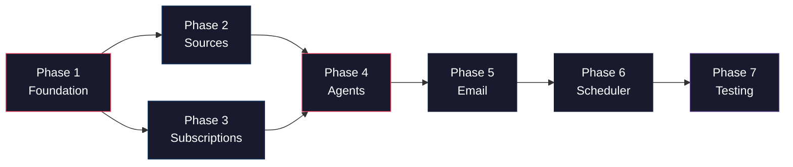

# 🚀 Implementation Phases — Multi-Agent MCP News Server

---

## Phase 1 — Foundation & Scaffolding
> *Get the project running with a working MCP server skeleton*

| # | Task | Key Files |
|---|------|-----------|
| 1 | Init project: `package.json`, `tsconfig.json`, install all deps | `package.json`, `tsconfig.json` |
| 2 | Create `.env.example` with all config vars (API keys, SMTP, LLM, cron) | `.env.example` |
| 3 | Define all shared TypeScript interfaces (`NewsArticle`, `UserProfile`, `NewsSource`, `AgentResult`) | `src/types.ts` |
| 4 | Build config loader (reads `.env`, validates required keys) | `src/config.ts` |
| 5 | Set up structured logger | `src/utils/logger.ts` |
| 6 | Create the MCP server entry point with basic health-check tool | `src/index.ts`, `src/server.ts` |

**✅ Milestone:** `npm run dev` starts an MCP server you can connect to from Claude Desktop / any MCP client.

---

## Phase 2 — Pluggable News Source Connectors
> *Build all the data-fetching adapters, each as an independent MCP tool*

| # | Task | Key Files |
|---|------|-----------|
| 1 | Create abstract `NewsSource` base class with rate-limiting & error handling | `src/sources/base.ts` |
| 2 | Implement **NewsAPI** connector (`/v2/everything`, `/v2/top-headlines`) | `src/sources/newsapi.ts` |
| 3 | Implement **NewsData.io** connector | `src/sources/newsdata.ts` |
| 4 | Implement **GNews** connector | `src/sources/gnews.ts` |
| 5 | Implement **GitHub Trending** scraper (cheerio-based HTML parse) | `src/sources/github-trending.ts` |
| 6 | Implement **HackerNews** connector (Firebase API) | `src/sources/hackernews.ts` |
| 7 | Build source registry (auto-discovers and registers all sources) | `src/server.ts` update |
| 8 | Add deduplication utility (URL-based + title-similarity) | `src/utils/dedup.ts` |

**✅ Milestone:** Calling `list_sources` tool returns all 5 sources. Each source can be queried independently and returns `NewsArticle[]`.

---

## Phase 3 — User Subscription & Persistence
> *Users can subscribe, update interests, and unsubscribe via MCP tools*

| # | Task | Key Files |
|---|------|-----------|
| 1 | Set up SQLite database with auto-migration (`users`, `digests`, `articles_cache` tables) | `src/db/database.ts` |
| 2 | Build User CRUD operations (create, read, update, delete) | `src/db/users.ts` |
| 3 | Register MCP tools: `subscribe`, `unsubscribe`, `update_interests` | `src/server.ts` update |
| 4 | Add keyword extraction from natural-language interests (LLM or NLP-based) | `src/db/users.ts` |

**✅ Milestone:** A user can call `subscribe` with email + interests, and the data persists in SQLite. `update_interests` and `unsubscribe` work correctly.

---

## Phase 4 — Multi-Agent Pipeline
> *The brain of the system — 4 agents working in sequence*

| # | Task | Key Files |
|---|------|-----------|
| 1 | **Searcher Agent** — parallel-queries all sources with user keywords, merges + deduplicates | `src/agents/searcher.ts` |
| 2 | **Analyst Agent** — LLM-powered relevance scoring (batch articles → score 1–10 per user interest) | `src/agents/analyst.ts` |
| 3 | **Curator Agent** — selects top N, groups by topic, generates 2–3 line summary per article via LLM | `src/agents/curator.ts` |
| 4 | **Mailer Agent** — renders HTML email from curated data, sends via Nodemailer | `src/agents/mailer.ts` |
| 5 | **Orchestrator** — chains agents sequentially: Searcher → Analyst → Curator → Mailer, with logging & error handling | `src/agents/orchestrator.ts` |

**✅ Milestone:** Calling the orchestrator with a user profile runs the full pipeline end-to-end and produces a structured curated output (or sends an email).

---

## Phase 5 — Email Template & Delivery
> *Beautiful, responsive email digest that works on all clients*

| # | Task | Key Files |
|---|------|-----------|
| 1 | Design MJML email template (header, topic sections, article cards, footer) | `src/email/template.ts` |
| 2 | Implement dynamic rendering (inject curated articles into template) | `src/email/template.ts` |
| 3 | Configure Nodemailer transport (SMTP/Gmail/Resend) | `src/agents/mailer.ts` |
| 4 | Add unsubscribe link generation | `src/email/template.ts` |

**✅ Milestone:** Running the pipeline delivers a real email that looks polished on both desktop and mobile.

---

## Phase 6 — Scheduler & Automation
> *Fully automated — fetches & delivers news on a schedule*

| # | Task | Key Files |
|---|------|-----------|
| 1 | Build cron manager (configurable interval via `.env`, default every 6 hours) | `src/scheduler/cron.ts` |
| 2 | Wire cron to iterate all subscribed users → trigger pipeline per user | `src/scheduler/cron.ts` |
| 3 | Register `get_news_now` MCP tool for on-demand fetch | `src/server.ts` update |
| 4 | Add digest history tracking (prevent re-sending same articles) | `src/db/database.ts` |

**✅ Milestone:** Server runs continuously, automatically fetching and emailing personalized news digests to all subscribers on schedule.

---

## Phase 7 — Testing & Verification
> *Ensure everything works reliably*

| # | Task | Key Files |
|---|------|-----------|
| 1 | Unit tests for each source connector (mocked HTTP) | `tests/sources/*.test.ts` |
| 2 | Unit tests for Searcher, Analyst, Curator agents (mocked deps) | `tests/agents/*.test.ts` |
| 3 | Integration test: full pipeline with mocked sources + LLM | `tests/pipeline.test.ts` |
| 4 | Manual E2E: subscribe → wait for cron → verify email in inbox | Manual |

**✅ Milestone:** `npx vitest run` passes all tests. Manual E2E confirms real email delivery.

---

## Phase Dependency Map

> **Phases 2 & 3 can run in parallel** since they're independent. Everything else is sequential.
